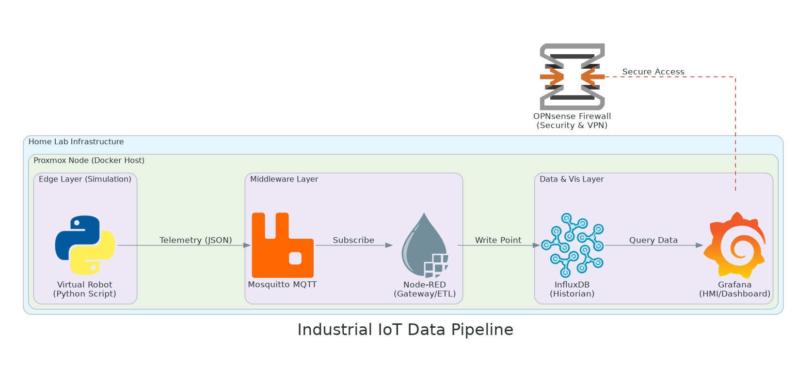
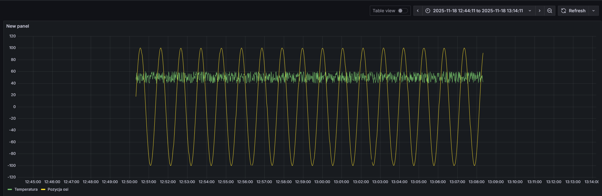
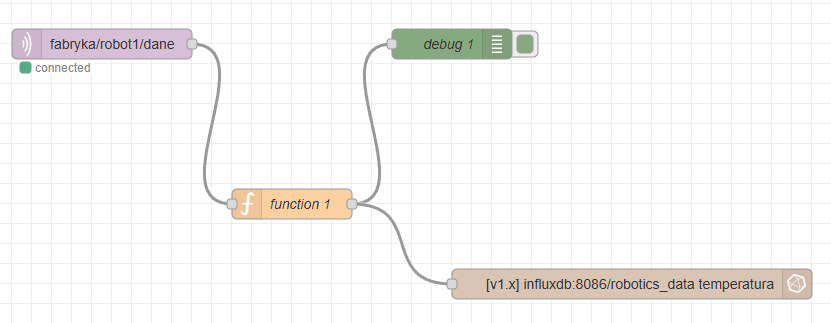

 Industrial IoT & Edge Computing Simulation Lab

## Project Overview

This repository showcases a comprehensive, full-stack home lab environment designed for simulating industrial data acquisition and processing within an Edge Computing paradigm. It bridges the gap between Operational Technology (OT) and Information Technology (IT) by demonstrating a robust pipeline for real-time telemetry from a simulated industrial robot, through data processing at the edge, to persistent storage and advanced visualization.

The primary goal of this project is to provide a hands-on demonstration of skills in designing, deploying, and managing modern IIoT (Industrial Internet of Things) architectures using DevOps principles and open-source technologies.

## Key Technologies & Tools

| Category            | Technology / Tool           | Description                                          |
| :------------------ | :-------------------------- | :--------------------------------------------------- |
| **Virtualization** | Proxmox VE                  | Hypervisor for robust VM/LXC management.             |
| **Containerization**| Docker / Docker Compose     | Orchestration of microservices.                      |
| **Edge Simulation** | Python (`asyncio`, `asyncua`, `paho-mqtt`) | Simulating an industrial robot (e.g., KUKA) generating telemetry data. |
| **Data Ingestion** | MQTT (Mosquitto)            | Lightweight, open standard messaging protocol for IoT. |
| **Data Processing** | Node-RED                    | Visual programming for event-driven flows and data transformation. |
| **Time-Series DB** | InfluxDB                    | High-performance database for sensor data.           |
| **Visualization** | Grafana                     | Real-time dashboards for operational insights.       |
| **Network Security**| OPNsense                    | Advanced firewall and routing for network segmentation and security. |
| **Version Control** | Git / GitHub                | Project management and collaboration.                |

## Architecture Diagram

*A high-level overview of the system architecture, illustrating the data flow from the simulated OT layer to IT services.*

## How It Works: Data Flow & Logic

1.  **Robot Simulation (OT Layer):** A Python script (`robot_sim.py`) emulates an industrial robot's OPC UA server, generating real-time telemetry such as temperature, position, and status.
2.  **MQTT Broker:** The Python script publishes this telemetry data to a central Mosquitto MQTT broker.
3.  **Edge Data Processing:** Node-RED subscribes to the MQTT topics, performs lightweight data processing (e.g., unit conversion, anomaly detection), and prepares data for storage.
4.  **Time-Series Storage:** Processed data is ingested into InfluxDB, optimized for high-volume, time-stamped sensor data.
5.  **Real-time Visualization:** Grafana dashboards connect to InfluxDB to display live telemetry, historical trends, and custom alerts, providing operational visibility.
6.  **Infrastructure & Security:** All core services are containerized with Docker Compose on a Proxmox VM, with OPNsense managing network segmentation, firewall rules, and VPN tunneling for enhanced security and robust operation.

## Key Features & Demonstrated Skills

* **OT/IT Integration:** Seamlessly integrating a simulated industrial robot (OT) with modern IT infrastructure.
* **Real-time Data Pipelines:** Implementing low-latency data ingestion and processing using MQTT and Node-RED.
* **Data Persistence & Visualization:** Utilizing InfluxDB for time-series data storage and Grafana for dynamic dashboards.
* **Containerization & Orchestration:** Deploying and managing complex multi-service applications with Docker and Docker Compose.
* **Network Security & Management:** Configuring advanced firewall rules, VPNs, and network segmentation with OPNsense.
* **Infrastructure as Code (IaC):** Managing environment configurations via `docker-compose.yml`.
* **Python Development:** Scripting for simulation and data interfacing.

## Screenshots

Experience real-time industrial telemetry visualization directly from the simulated robot:
*Click the image or [this link](https://ds.naszebagna.ovh) to access the live Grafana dashboard. This demo provides a read-only view of the data pipeline.*

*Real-time telemetry visualization from the simulated industrial robot, showcasing temperature and position data over time.*

*Example Node-RED flow demonstrating data ingestion from MQTT, processing, and output to InfluxDB.*

